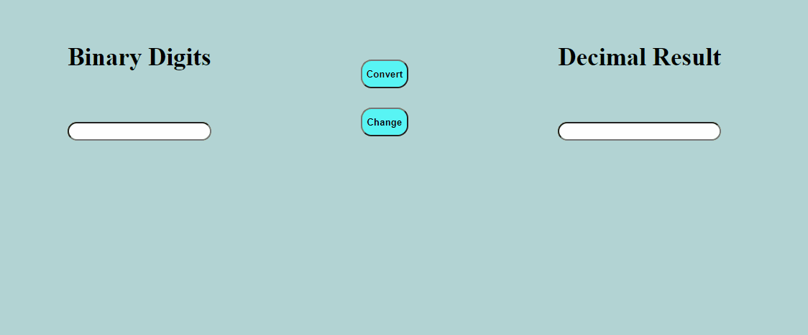

# Binary to Decimal and Decimal to Binary Converter
<h1 align="center">
    
</h1>

 

## About:

A binary to decimal and decimal to binary converter

 
<h2> Technologies:</h2>
<li> HTML</li>
<li> CSS</li>
<li> JavaScript</li>

 

<h2 align="center"> Website link:</h2>

<a target="_blank">
https://tcheagow.github.io/Conversor-Bin-to-Dec-and-Dec-to-Bin/
<a>

 
 
 
    
> <h2 align="center"> © By Thiago Aparecido (Tcheagow) </h2> 
 
